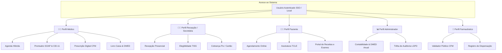
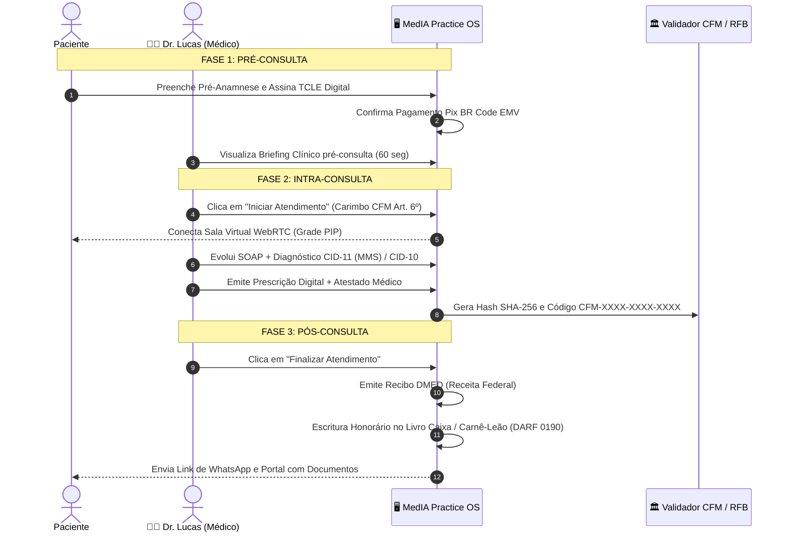

# Manual Operacional e Guia de Fluxos: MedIA Practice & Telemedicina OS

Este documento é o **Manual Oficial de Operação** da plataforma **MedIA Practice & Telemedicina OS**, projetada para consultórios particulares, clínicas médicas e médicos que atuam presencialmente e por telemedicina (*home office*).

---

## 📌 1. Visão Geral e Princípios Operacionais

O sistema opera no modelo **Híbrido de Alta Eficiência**, combinando o atendimento clínico presencial no consultório físico com a prática de telemedicina em conformidade estrita com a **Resolução CFM nº 2.314/2022**.

### Pilares Fundamentais:
1. **Centrado no Médico**: Eliminação de burocracias desnecessárias e foco na propedêutica e raciocínio clínico.
2. **Dual-Coding Diagnóstico**: Suporte nativo à **CID-11 da OMS** (padrão global moderno) com equivalência automática para a **CID-10** (exigida pela ANS nas guias TISS e operadoras).
3. **Prescrição Digital de Alta Confiança**: Assinatura digital ICP-Brasil e código público validador (`CFM-XXXX-XXXX-XXXX`) para dispensação em qualquer farmácia do Brasil.
4. **Fechamento Contábil e Fiscal Automático**: Geração de recibos DMED para o IRPF do paciente e escrituração automática no Livro Caixa do médico com cálculo da DARF 0190 do Carnê-Leão.

---

## 👥 2. Perfis de Usuários e Matriz de Competências

### Detalhamento por Perfil:

| Perfil | Finalidade Principal | Recursos Habilitados |
| :--- | :--- | :--- |
| **Médico** | Condução soberana do ato médico presencial e telemedicina | Agenda, Prontuário SOAP, Sala WebRTC, CID-11 Dual-Coding, Prescritor CFM, Atestados, Livro Caixa |
| **Recepção** | Apoio operacional, triagem e controle de acesso | Cadastro de pacientes, agendamentos, baixa de pagamentos, elegibilidade de guias TISS |
| **Paciente** | Acesso ao seu histórico, teleconsulta e documentos | Agendamento online, pagamento Pix, assinatura do TCLE, sala virtual, download de receitas e recibos IRPF |
| **Administrador** | Governança clínica, financeira e conformidade | Gestão de unidades/salas, relatórios gerenciais, exportação DMED e auditoria LGPD Art. 11 |
| **Farmacêutico** | Verificação externa de prescrições | Validador público oficial CFM/ICP-Brasil sem acesso ao prontuário clínico |

---

## 🧭 3. Guia Operacional Completo: A Jornada do Médico

A jornada do médico é estruturada em **três fases contínuas e integradas**:

---

### 3.1. Fase 1: Pré-Consulta (Preparação e Briefing Clínico)

1. **Gestão da Agenda do Dia**:
   - Acesse a aba **Agenda** no menu lateral.
   - Filtre as consultas pelo modo de trabalho: **Todas**, **🏢 Consultório (Presencial)** ou **🏠 Home Office (Telemedicina)**.
2. **Envio de Link e Termo de Telemedicina (TCLE)**:
   - Para atendimentos remotos, clique em **"Copiar Link do Paciente"** ou **"Enviar via WhatsApp"**.
   - O paciente recebe um link direto no qual visualiza o **TCLE** conforme o Art. 4º da Resolução CFM nº 2.314/2022 e confirma sua ciência com 1 clique antes da chamada.
3. **Cobrança Antecipada Integrada (Pix EMV BR Code)**:
   - O sistema gera automaticamente o QR Code Pix com identificador exclusivo de transação (*txid*) e código copia e cola.
   - A confirmação de pagamento é refletida na agenda em tempo real com indicador visual verde.
4. **Briefing Clínico de 60 Segundos**:
   - Antes de abrir o atendimento, o médico visualiza na barra superior o resumo de pré-anamnese:
     - Queixa principal descrita pelo paciente.
     - Medicações em uso contínuo informadas previamente.
     - Alergias declaradas com alerta vermelho destacado.
     - Últimas aferições de pressão arterial e glicemia.

---

### 3.2. Fase 2: Intra-Consulta (Atendimento Clínico & Prescrição)

1. **Abertura do Atendimento e Registro Temporal Obrigatório**:
   - Clique no botão **"Iniciar Atendimento"**.
   - O sistema grava imediatamente o carimbo de data e hora UTC e local no banco de dados, atendendo à exigência do **Art. 6º da Resolução CFM nº 2.314/2022**.
2. **Sala de Telemedicina Integrada**:
   - A chamada de vídeo WebRTC roda lado a lado com o prontuário em grade *Picture-in-Picture* (PIP), permitindo ao médico examinar o paciente sem perder a visão das anotações clínicas.
   - **Botão de Segurança CFM (Art. 3º)**: Caso o médico identifique que o quadro clínico requer propedêutica armada física inadiável, pode clicar em *"Converter para Consulta Presencial"*, gerando registro formal de encaminhamento no prontuário.
3. **Evolução SOAP Estruturada**:
   - **Subjetivo (S)**: Histórico da queixa atual, evolução de sintomas e hábitos.
   - **Objetivo (O)**: Sinais vitais, exame do estado mental ou exame físico específico direcionado pelos templates de especialidade (*Cardiologia, Psiquiatria, Dermatologia, Pediatria, Clínica Médica*).
   - **Avaliação (A) com CID-11 da OMS**:
     - Digite o termo clínico ou código no campo de busca (ex.: `hipertensao`, `6B00`, `DM2`, `Burnout`).
     - O sistema realiza correspondência fonética e exibe o código **CID-11 MMS** da OMS ao lado do código correspondente da **CID-10**, garantindo que o faturamento de convênios (TISS) continue perfeitamente compatível.
   - **Plano (P) & Prescrição Digital**:
     - Digite os medicamentos. O sistema cruza os fármacos com a lista de alergias do paciente para prevenir eventos adversos graves.
     - Emissão com selo de assinatura digital ICP-Brasil e código público alfanumérico no formato `CFM-XXXX-XXXX-XXXX`.
     - Opção de emissão de atestados médicos com dias de repouso e sigilo de diagnóstico opcional (inclusão do CID apenas com autorização expressa do paciente).

---

### 3.3. Fase 3: Pós-Consulta (Despacho, Fiscal e Livro Caixa)

1. **Finalização com 1 Clique**:
   - Ao clicar em **"Finalizar Consulta"**, o sistema executa atomicamente o pacote de encerramento:
2. **Despacho Digital ao Paciente**:
   - O paciente recebe no seu WhatsApp ou por SMS a notificação com link seguro de acesso (`/portal_paciente.html?consulta=...`).
   - Todos os documentos (receita, atestado, requisição de exames) podem ser baixados em PDF assinado com QR Code validador para farmácias.
3. **Emissão de Recibo Fiscal DMED**:
   - Geração imediata do número de recibo com dados fiscais do médico (CPF/CRM) e do paciente (CPF) para dedução legal no Imposto de Renda (IRPF).
4. **Escrituração Automática no Livro Caixa / Carnê-Leão**:
   - O honorário da consulta é creditado na contabilidade do médico, segregando automaticamente a receita entre *Consultório Presencial* e *Telemedicina Home Office*.
   - Dedução de despesas operacionais cadastradas e cálculo prévio da **DARF 0190** para recolhimento mensal à Receita Federal.
5. **Agendamento de Retorno**:
   - Definição do prazo sugerido (30, 45 ou 60 dias) com inserção automática do lembrete na agenda do consultório.

---

## 🏢 4. Guia Rápido para os Demais Perfis

### Perfil Recepção / Secretária:
1. **Check-in de Pacientes**: Localize o paciente na lista da agenda e marque como "Na Sala de Espera".
2. **Cobrança Particular**: Confirme a leitura do Pix pelo paciente ou registre o recebimento por cartão de crédito/débito.
3. **Guias TISS ANS**: Para consultas por convênio, gere a Guia de Consulta SADT no padrão TISS 4.01.00 com validação de elegibilidade na operadora.

### Perfil Paciente:
1. **Acesso Fácil**: O paciente não precisa instalar nenhum aplicativo nem criar cadastros complexos.
2. **Sala de Espera Virtual**: Ao clicar no link enviado por WhatsApp, o paciente acessa a sala de espera, realiza o teste prévio de câmera e microfone e lê o TCLE.
3. **Portal de Documentos**: Ao término da consulta, tem acesso perpétuo às receitas válidas e recibos para o IRPF.

### Perfil Farmacêutico:
1. **Validação Pública**: Acesse `http://localhost:8000/api/v1/prescricao/validar/{codigo}` ou aponte a câmera para o QR Code da receita impressa/digital.
2. **Conferência Segura**: O sistema confirma o nome do médico, CRM, data de emissão e medicamentos prescritos com hash SHA-256 inviolável, sem revelar dados sensíveis do prontuário do paciente.

---

## 🛡️ 5. Conformidade Regulatória e Segurança (LGPD / CFM / ANS)

* **Resolução CFM nº 2.314/2022**: Cumprimento integral dos Arts. 2º (Modalidades), 3º (Autonomia e conversão para presencial), 4º (TCLE eletrônico), 5º (Identificação do médico) e 6º (Carimbo de tempo e prontuário).
* **LGPD (Lei nº 13.709/2018, Art. 11)**: Tratamento de dados sensíveis de saúde com trilha de auditoria criptográfica imutável encadeada por SHA-256.
* **IN RFB nº 1.987/2020**: Conformidade dos registros financeiros com a Declaração de Serviços Médicos e de Saúde (DMED).
* **Padrão TISS ANS 4.01.00**: Interoperabilidade de guias eletrônicas de consulta e SADT com operadoras de planos de saúde.
